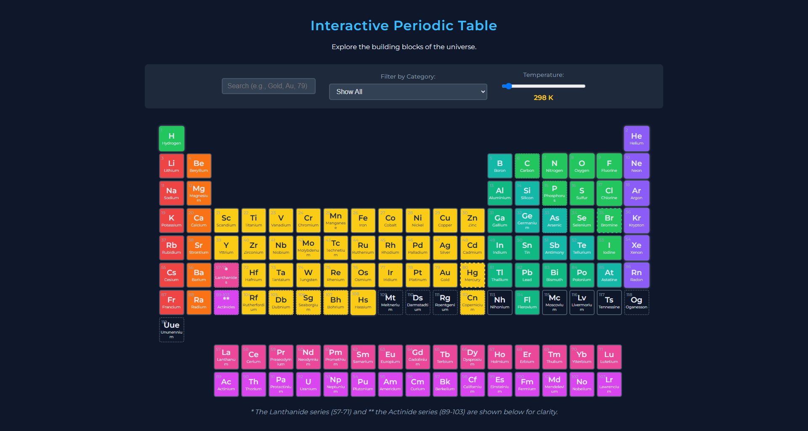

# Advanced Interactive Periodic Table

An advanced, feature-rich, and beautifully designed web-based periodic table of elements. This project provides an interactive and educational tool for exploring element properties, built entirely with modern vanilla HTML, CSS, and JavaScript.

[](https://aakhalidhruv28.github.io/Interactive-Periodic-Table/)

 

## ✨ Features

This project goes beyond a simple table and includes a powerful set of interactive features:

*   **Complete Element Data:** Displays all 118 elements with detailed information fetched dynamically from a public API.
*   **Modern & Responsive UI:** A sleek, dark-themed design that is easy to use on both desktop and mobile devices.
*   **Dynamic Data Loading:** Element data is loaded from the [Periodic-Table-JSON](https://raw.githubusercontent.com/Bowserinator/Periodic-Table-JSON/master/PeriodicTableJSON.json) API, ensuring the information is up-to-date and the application is lightweight.
*   **Interactive Search:** Instantly find elements by typing their name, symbol, or atomic number. Non-matching elements are dimmed for clarity.
*   **Category Filtering:** Filter the table to highlight specific element groups (e.g., Noble Gases, Halogens) using a simple dropdown menu.
*   **Temperature Slider:** A dynamic slider that allows you to change the ambient temperature (in Kelvin) and see the elements change their state (Solid, Liquid, Gas) in real-time.
*   **Detailed Element Modal:** Clicking on an element opens a detailed pop-up view with properties like:
    *   Atomic Mass, Number, and Symbol
    *   Category and Phase at STP
    *   Density, Melting, and Boiling Points
    *   A brief summary and discovery information
    *   A direct link to the element's Wikipedia page for further reading.

## 🛠️ Technologies Used

This project was built using only core web technologies, without any frameworks or libraries.

*   **HTML5:** For the structure and content of the application.
*   **CSS3:** For all styling, including the modern dark theme, grid layout, animations, and responsive design.
*   **JavaScript (ES6+):** For all interactivity, including:
    *   Fetching data from a third-party API (`fetch` API).
    *   Dynamically generating the periodic table grid.
    *   Handling all user events for search, filtering, and the temperature slider.
    *   Managing the modal pop-up.

## 🚀 Getting Started

To run this project locally, follow these simple steps:

### Prerequisites

You only need a modern web browser that supports HTML5, CSS3, and ES6 JavaScript (e.g., Chrome, Firefox, Edge).

### Installation & Setup

1.  **Clone the repository:**
    ```bash
    git clone https://github.com/aakhalidhruv28/Interactive-Periodic-Table.git
    ```
2.  **Navigate to the project directory:**
    ```bash
    cd Interactive-Periodic-Table
    ```
3.  **Open the `index.html` file:**
    Simply open the `index.html` file in your favorite web browser.

    *On Windows:*
    ```bash
    start index.html
    ```
    *On macOS:*
    ```bash
    open index.html
    ```
    *On Linux:*
    ```bash
    xdg-open index.html
    ```

    And that's it! The application will load, fetch the element data, and be ready for you to explore.

## 📜 License

This project is open-source and available under the [MIT License](LICENSE).
